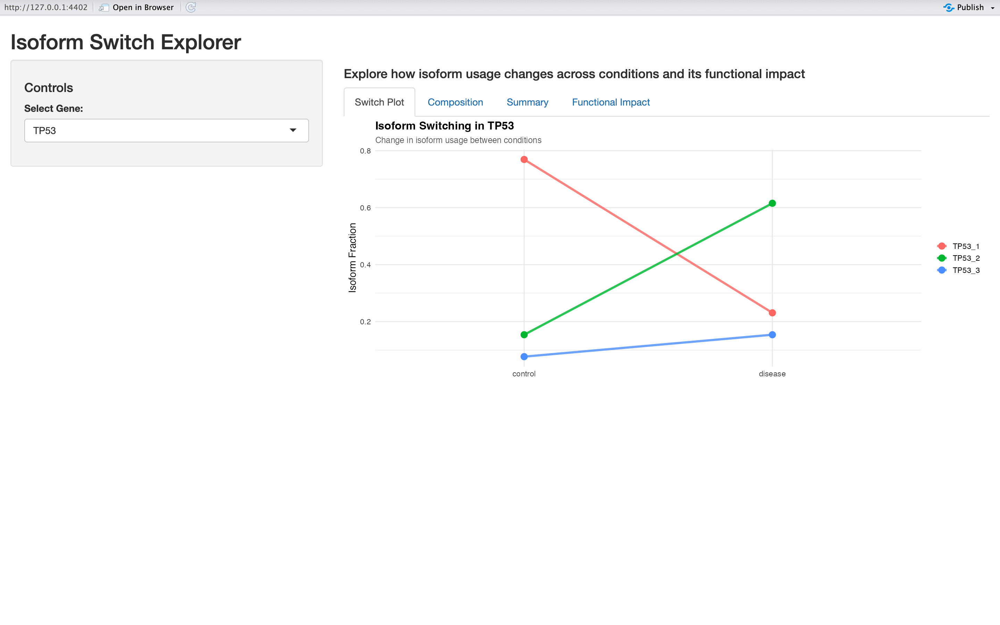

# Isoform Switch Dashboard (Shiny App)

## Overview
This project is an interactive Shiny dashboard for exploring isoform switching in gene expression data. It allows users to visualize isoform-level expression changes across conditions and understand alternative splicing patterns.

## Biological Context
Isoform switching refers to changes in the relative usage of different transcript isoforms of the same gene, often due to alternative splicing. This can lead to functional differences in proteins.

## Features
- Interactive visualization of isoform expression
- Condition-wise comparison
- Isoform fraction (IF) calculation
- Clean Shiny-based UI

## Screenshot


## Tech Stack
- R
- Shiny
- dplyr
- ggplot2

## How to Run
1. Clone this repository
2. Open `app.R` in RStudio
3. Run the app:

```r
shiny::runApp()
